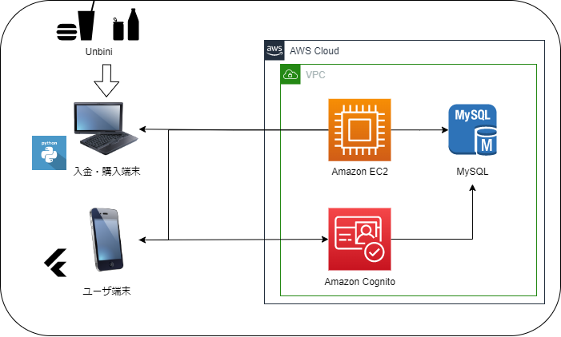

# UbiPay-Project-for-Public

## 注意
本レポジトリは、公開用にセキュリティ上問題のない一部のファイルのみを置いています。そのままコードを実行しても動作しない可能性があります。

## UbiPayとは
UbiPayは、奈良先端科学技術大学院大学ユビキタス・コンピューティングシステム研究室内に存在する、飲料や軽食を提供する無人販売所「ユンビニ」で使用できるQRコード決済アプリケーションです。

## 背景
ユンビニはこれまで、全ての決済を現金で行っていました。具体的には、商品の値段分の現金を箱に入れ、商品をそのまま持っていくような形式です。しかし、この方法は簡単であるものの、ユーザにとって次のような課題がありました。

1. 決済のために常に現金が必要となり、利便性が低い
2. 現金をまとめる箱をそのまま置いているため、防犯上の問題がある
3. 誰がいつ、何を買ったのか分からない
4. 在庫がどの程度残っているのか把握できず、仕入れの最適化ができない

## 解決策
以上の課題を解決するために、我々は一定額の現金をデポジットし、その残高を電子的に管理して決済を行うSuicaやPaypayのようなシステムが必要であると考えました。しかし、PayPay等既存の決済システムをユンビニに組み込むためには、申請面で様々な困難が予想され、在庫の管理等のユンビニの課題の解決に必要な機能をカスタマイズしにくいという問題がありました。

そこで、我々は、以上に挙げた課題を解決可能であり、将来的に様々な機能を拡張することを想定したスケーラブルなQRコード決済アプリ、UbiPayを独自開発しました。

## UbiPayのアーキテクチャ
UbiPayのアーキテクチャは図１に示す通りです。

UbiPayのシステムは大きく「入金・購入ターミナル/deposit_terminal」、「APIサーバ/server_side」、「ユーザのスマートフォン端末/client_side」の３つの要素から構成されています。

それぞれの機能を完結にまとめると次の通りです。

- 入金・購入ターミナル
    - ユンビニの棚の上に設置されたタッチパネルディスプレイ端末。現金のデポジットと商品の購入操作が可能。RaspberryPiとPythonによって実装

- APIサーバ
    - 入金・購入ターミナルやユーザのスマートフォン端末からのリクエストを操作し、データベースの操作やユーザの登録などを行う。aws上にEC2を立て、Pythonで実装

- ユーザのスマートフォン端末
    - 残高の確認、QRコードの生成・表示、取引履歴の確認等が可能。FlutterでUIを実装。ユーザ管理、ログイン処理にはamazon cognito、amazon amplifyを使用

次に、各要素を詳細に説明します。

### 入金・購入ターミナル/deposit_terminal
入金・購入ターミナルでは、ユーザが実際にユンビニで買い物をしたり、現金を入金（デポジット）する際の処理を行います。このような端末を用意したのは、スマートフォン端末のみで完結させてしまうと、不当な額の入金を検知できなかったり、実際にユンビニまで行かなくとも自身の残高を変更できてしまうといったセキュリティ上の懸念を無くすためです。

入金・購入ターミナルに実装されている機能は主に、

1. ユーザからの指示の入力UI
2. QRコードの読み取り
3. APIサーバに暗号化したリクエストを送る
4. 管理者パスワードの入力

の３つです。　　
ユーザからの指示を受け取る入力UIには、pysimpleGUIというライブラリを使用し、直感的に操作できるようにしています。

QRコードの読み取りはOpen CVを使って実装しています。

APIサーバへのリクエストは、request等一般的な方法によって行っています。この際、セキュリティ性を向上させるために、通信路を予め共有したAES128bitの鍵で暗号化し、またリクエストにサーバで生成した乱数を挿入することで、通信内容を毎回変化させ、リプレイ攻撃を防いでいます。同時に、リクエストにメッセージ認証符号も添付することで、通信路での改ざん検知機能を加えてセキュリティ性を向上させています。

最後に、管理者パスワードの入力ですが、これはユーザが実際に入金した以上の金額をサーバに登録することを防ぐため、ユンビニ管理者が目視で入金額を確認して入金できる仕様にしました。このパスワードはハッシュ化されてRaspberryPI本体に保存され、入力の度にソルトを加えたハッシュ値を計算して照合することで、パスワードを平文で保存することを防いでいます。  

### APIサーバ/server_side
APIサーバでは

### ユーザのスマートフォン端末/client_side

### 工夫点
システム設計時の工夫点として、次の３つが挙げられます。

1. ユーザ利便性の追求

2. セキュリティ性

3. スケーラビリティ

## 使用方法

## メンバー
1. バックエンド・フロントエンド開発、全体設計 :　Hikoto Iseda/伊勢田氷琴（M1 Student of Ubiquitous Computing Syatem Lab, at Nara Institute of Science and Technology, Nara, Ikoma）
2. UIデザイン : Nanako Michiura/道浦菜々子（M1 Student of Ubiquitous Computing Syatem Lab, at Nara Institute of Science and Technology, Nara, Ikoma）

# UbiPay-Project-for-Public

## Attention

## What is UbiPay?

## Background

## Solution

## UbiPay architecture

### client_side

### server_side

### deposit_terminal

### Unique point

## How to use

## Members
1. Backend,frontend, deposit terminal and design : Hikoto Iseda（M1 Student of Ubiquitous Computing Syatem Lab, at Nara Institute of Science and Technology, Nara, Ikoma）
2. UI design : Nanako Michiura（M1 Student of Ubiquitous Computing Syatem Lab, at Nara Institute of Science and Technology, Nara, Ikoma）

